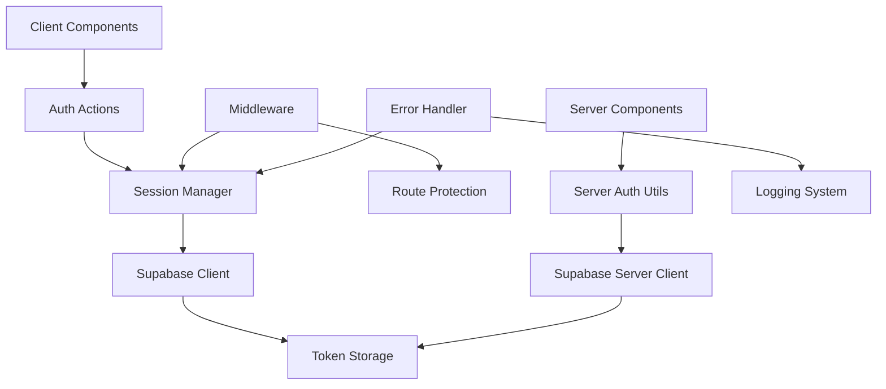
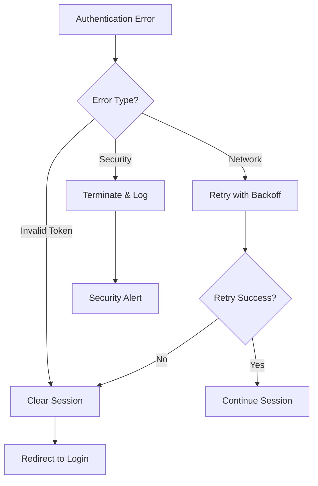

# Design Document: Authentication Session Management Fix

## Overview

This design addresses critical authentication session management issues in the Next.js service booking application using Supabase. The primary problem is "AuthApiError: Invalid Refresh Token: Refresh Token Not Found" errors, which occur due to improper token storage, retrieval, and refresh mechanisms.

The solution implements a comprehensive session management system with:
- Proper Supabase client configuration for automatic token refresh
- Secure HTTP-only cookie storage for refresh tokens
- Robust error handling and recovery mechanisms
- Cross-tab session synchronization
- Enhanced middleware protection with graceful error handling

## Architecture

The authentication system follows a layered architecture:



### Key Components:

1. **Enhanced Supabase Clients**: Properly configured client and server instances with automatic token refresh
2. **Session Manager**: Centralized session state management with cross-tab synchronization
3. **Token Storage**: Secure HTTP-only cookie storage with proper security attributes
4. **Error Handler**: Comprehensive error handling with retry logic and graceful degradation
5. **Enhanced Middleware**: Robust route protection with session recovery

## Components and Interfaces

### Enhanced Supabase Client Configuration

**Client-side (`lib/supabase/client.ts`)**:
```typescript
interface SupabaseClientConfig {
  auth: {
    autoRefreshToken: boolean;
    persistSession: boolean;
    detectSessionInUrl: boolean;
    storage: CustomStorageAdapter;
    storageKey: string;
  };
}

interface CustomStorageAdapter {
  getItem(key: string): Promise<string | null>;
  setItem(key: string, value: string): Promise<void>;
  removeItem(key: string): Promise<void>;
}
```

**Server-side (`lib/supabase/server.ts`)**:
```typescript
interface ServerClientConfig {
  cookies: {
    getAll(): Cookie[];
    setAll(cookies: CookieOptions[]): void;
  };
  cookieOptions: {
    httpOnly: boolean;
    secure: boolean;
    sameSite: 'lax' | 'strict' | 'none';
    maxAge: number;
    path: string;
  };
}
```

### Session Manager

```typescript
interface SessionManager {
  // Session state management
  getCurrentSession(): Promise<Session | null>;
  refreshSession(): Promise<Session | null>;
  clearSession(): Promise<void>;
  
  // Cross-tab synchronization
  onSessionChange(callback: (session: Session | null) => void): () => void;
  broadcastSessionChange(session: Session | null): void;
  
  // Recovery mechanisms
  recoverSession(): Promise<Session | null>;
  handleSessionError(error: AuthError): Promise<void>;
}

interface Session {
  user: User;
  accessToken: string;
  refreshToken: string;
  expiresAt: number;
}
```

### Error Handler

```typescript
interface AuthErrorHandler {
  handleError(error: AuthError, context: ErrorContext): Promise<ErrorResult>;
  isRecoverable(error: AuthError): boolean;
  shouldRetry(error: AuthError, attemptCount: number): boolean;
  logError(error: AuthError, context: ErrorContext): void;
}

interface ErrorContext {
  operation: 'login' | 'refresh' | 'logout' | 'getUser';
  url?: string;
  userAgent?: string;
  timestamp: Date;
}

interface ErrorResult {
  action: 'retry' | 'logout' | 'redirect' | 'ignore';
  message?: string;
  redirectUrl?: string;
  retryAfter?: number;
}
```

### Enhanced Middleware

```typescript
interface AuthMiddleware {
  checkAuthentication(request: NextRequest): Promise<AuthResult>;
  handleAuthError(error: AuthError, request: NextRequest): Promise<NextResponse>;
  refreshTokens(request: NextRequest): Promise<RefreshResult>;
}

interface AuthResult {
  isAuthenticated: boolean;
  user?: User;
  error?: AuthError;
  shouldRefresh?: boolean;
}

interface RefreshResult {
  success: boolean;
  newTokens?: TokenPair;
  error?: AuthError;
}
```

## Data Models

### Authentication State

```typescript
interface AuthState {
  user: User | null;
  session: Session | null;
  loading: boolean;
  error: AuthError | null;
  lastRefresh: Date | null;
}

interface User {
  id: string;
  email: string;
  name: string;
  role: 'customer' | 'admin' | 'mechanic' | 'owner';
  status: 'active' | 'inactive';
  created_at: string;
}

interface TokenPair {
  accessToken: string;
  refreshToken: string;
  expiresAt: number;
}
```

### Error Types

```typescript
interface AuthError {
  code: string;
  message: string;
  status?: number;
  details?: Record<string, any>;
  timestamp: Date;
  recoverable: boolean;
}

type AuthErrorCode = 
  | 'refresh_token_not_found'
  | 'invalid_refresh_token'
  | 'token_expired'
  | 'network_error'
  | 'session_not_found'
  | 'invalid_session'
  | 'rate_limit_exceeded';
```

## Correctness Properties

*A property is a characteristic or behavior that should hold true across all valid executions of a system-essentially, a formal statement about what the system should do. Properties serve as the bridge between human-readable specifications and machine-verifiable correctness guarantees.*

### Converting EARS to Properties

Based on the prework analysis, I'll convert the testable acceptance criteria into universally quantified properties, consolidating redundant properties for efficiency:

**Property 1: Automatic Token Refresh**
*For any* user session with an expired access token, the Auth_System should automatically attempt to refresh it using the stored refresh token and update both tokens in storage upon success
**Validates: Requirements 1.1, 1.3, 1.5**

**Property 2: Secure Token Storage**
*For any* authentication token storage operation, the Token_Storage should use HTTP-only cookies with secure flags, SameSite attributes, proper expiration times, and appropriate storage mechanisms for each token type
**Validates: Requirements 2.4, 2.5, 6.5**

**Property 3: Session Configuration Consistency**
*For any* Supabase client creation, the Auth_System should use consistent session configuration between client and server instances
**Validates: Requirements 2.3**

**Property 4: Token Validation and Server Reading**
*For any* server request, the Server_Handler should successfully read authentication tokens from HTTP-only cookies securely
**Validates: Requirements 2.2**

**Property 5: Authentication Error Classification and Retry**
*For any* authentication error, the Error_Handler should correctly classify it as recoverable or non-recoverable and implement appropriate retry logic with exponential backoff for network errors
**Validates: Requirements 3.2, 3.3**

**Property 6: Rate Limiting for Authentication Failures**
*For any* sequence of multiple authentication failures, the Error_Handler should implement rate limiting to prevent abuse
**Validates: Requirements 3.4**

**Property 7: Cross-Tab Session Synchronization**
*For any* authentication state change (login, logout, token refresh, session expiration), the Session_Manager should synchronize the change across all browser tabs and update the UI accordingly
**Validates: Requirements 4.1, 4.2, 4.3, 4.4**

**Property 8: Concurrent Token Refresh Handling**
*For any* concurrent token refresh attempts, the Session_Manager should handle them without race conditions
**Validates: Requirements 4.5**

**Property 9: Robust Middleware Authentication**
*For any* invalid session encountered by middleware, the Auth_System should attempt token refresh before redirecting, clear invalid tokens on refresh failure, and prevent infinite redirect loops
**Validates: Requirements 5.1, 5.2, 5.3**

**Property 10: Security-First Authentication**
*For any* uncertain authentication state, the Middleware_Guard should err on the side of security and require re-authentication while preserving the original requested URL
**Validates: Requirements 5.4, 5.5**

**Property 11: Proactive Token Management**
*For any* token approaching expiration, the Session_Manager should proactively refresh it, and for any expired token, the Token_Storage should automatically clean it up
**Validates: Requirements 6.1, 6.2**

**Property 12: Token Integrity Validation**
*For any* API request, the Auth_System should validate token integrity before using the token
**Validates: Requirements 6.3**

**Property 13: Server-Side Token Revocation**
*For any* explicit logout operation, the Auth_System should revoke tokens on the server side
**Validates: Requirements 6.4**

**Property 14: Session Recovery and Restoration**
*For any* application start, the Session_Manager should attempt to restore the user session from stored tokens, and if restoration fails, clear invalid tokens and show the login screen
**Validates: Requirements 7.1, 7.2**

**Property 15: Network Recovery Session Validation**
*For any* network connectivity restoration after being offline, the Session_Manager should validate and refresh the session
**Validates: Requirements 7.3**

**Property 16: Partial Session State Handling**
*For any* partial session state (e.g., missing refresh token), the Session_Manager should handle it gracefully and redirect to intended destination upon successful recovery
**Validates: Requirements 7.4, 7.5**

**Property 17: Comprehensive Authentication Logging**
*For any* authentication event (errors, successful operations, state transitions, failures), the system should log detailed information with timestamps while sanitizing sensitive data
**Validates: Requirements 8.1, 8.2, 8.3, 8.4, 8.5**

## Error Handling

The error handling strategy focuses on graceful degradation and user experience preservation:

### Error Categories

1. **Recoverable Errors**: Network timeouts, temporary server issues
   - Implement exponential backoff retry
   - Show user-friendly loading states
   - Maintain session state during recovery

2. **Non-Recoverable Errors**: Invalid refresh tokens, malformed tokens
   - Clear all authentication state
   - Redirect to login with clear messaging
   - Log detailed error information

3. **Security Errors**: Token tampering, suspicious activity
   - Immediate session termination
   - Enhanced logging for security monitoring
   - Rate limiting implementation

### Error Recovery Flow



### Error Messages

- **User-Facing**: Clear, actionable messages without technical details
- **Developer Logs**: Detailed error context, stack traces, and debugging information
- **Security Logs**: Sanitized information for monitoring and alerting

## Testing Strategy

### Dual Testing Approach

The testing strategy combines unit tests for specific scenarios with property-based tests for comprehensive coverage:

**Unit Tests**:
- Specific error scenarios (refresh_token_not_found)
- Edge cases (partial session states, network failures)
- Integration points between components
- Security boundary testing

**Property-Based Tests**:
- Universal session management properties
- Token lifecycle management across all scenarios
- Cross-tab synchronization behavior
- Error handling and recovery patterns

### Property-Based Testing Configuration

- **Library**: Use `@fast-check/jest` for TypeScript/Jest environment
- **Iterations**: Minimum 100 iterations per property test
- **Test Tagging**: Each property test references its design document property
- **Tag Format**: `Feature: auth-session-management, Property {number}: {property_text}`

### Test Categories

1. **Session Lifecycle Tests**
   - Login/logout flows
   - Token refresh cycles
   - Session expiration handling

2. **Error Scenario Tests**
   - Network failure recovery
   - Invalid token handling
   - Rate limiting behavior

3. **Security Tests**
   - Token storage security
   - Cross-site request protection
   - Session hijacking prevention

4. **Performance Tests**
   - Concurrent session handling
   - Token refresh performance
   - Memory leak prevention

### Integration Testing

- **Multi-tab scenarios**: Test session synchronization across browser tabs
- **Network conditions**: Test behavior under various network conditions
- **Server integration**: Test server-side token validation and revocation
- **Middleware integration**: Test route protection and authentication flows