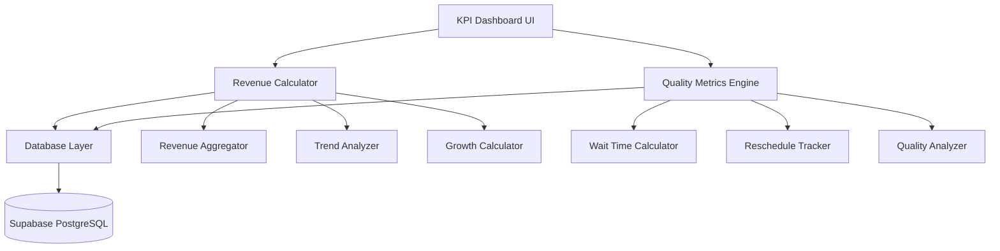

# Design Document: KPI Revenue and Quality Enhancements

## Overview

This design document specifies the technical implementation for enhancing the KPI Dashboard with real revenue data and improved quality metrics. The current implementation uses placeholder values for several key metrics (reschedule rate: 5%, wait time: 30 min, customer satisfaction: 85%) and lacks detailed revenue analysis capabilities.

### Goals

1. Replace all placeholder KPI calculations with real database-driven calculations
2. Implement comprehensive revenue analytics including daily/monthly trends, growth rates, and service type breakdowns
3. Add quality metrics including reschedule rate, wait time, cancellation analysis, and first-time fix rate
4. Enhance peak hours analysis with revenue correlation
5. Optimize database queries for performance with large datasets
6. Provide date range filtering for all metrics

### Non-Goals

1. Implementing payment gateway integration (out of scope)
2. Real-time streaming updates (will use standard server-side rendering)
3. Customer satisfaction surveys (placeholder will remain until survey system is built)
4. Predictive analytics or machine learning models

## Architecture

### System Components



### Component Responsibilities

**Revenue Calculator** (`frontend/src/lib/kpi/revenue-calculator.ts`)
- Computes all revenue-related metrics from booking and service data
- Handles date range filtering and aggregation
- Calculates growth rates and trends
- Provides revenue breakdowns by service type and mechanic

**Quality Metrics Engine** (`frontend/src/lib/kpi/quality-metrics.ts`)
- Calculates service quality indicators
- Tracks reschedule rates from audit logs
- Computes average wait times from booking to service start
- Analyzes cancellation patterns and first-time fix rates

**Database Layer**
- Executes optimized queries with proper joins and indexes
- Uses Supabase client for database access
- Implements connection pooling and query caching where appropriate

### Data Flow

1. User loads KPI Dashboard with optional date range parameters
2. Dashboard component calls `calculateKPIMetrics()` server action
3. Server action invokes Revenue Calculator and Quality Metrics Engine
4. Both components query database with optimized joins
5. Results are aggregated and formatted
6. Dashboard renders metrics and visualizations

## Components and Interfaces

### Revenue Calculator Interface

```typescript
// frontend/src/lib/kpi/revenue-calculator.ts

export interface RevenueMetrics {
  totalRevenue: number;
  averageBookingValue: number;
  revenuePerCompletedBooking: number;
  dailyRevenue: Array<{ date: string; revenue: number }>;
  monthlyRevenue: Array<{ month: string; revenue: number }>;
  growthRates: {
    daily: number | null;
    weekly: number | null;
    monthly: number | null;
    status: string;
  };
  revenueByServiceType: Array<{
    serviceTypeName: string;
    revenue: number;
    percentage: number;
  }>;
  revenueByMechanic: Array<{
    mechanicName: string;
    revenue: number;
  }>;
  peakHoursRevenue: Array<{
    hour: number;
    bookingCount: number;
    totalRevenue: number;
    averageRevenuePerBooking: number;
  }>;
}

export async function calculateRevenueMetrics(
  startDate: Date,
  endDate: Date
): Promise<RevenueMetrics>;
```

### Quality Metrics Engine Interface

```typescript
// frontend/src/lib/kpi/quality-metrics.ts

export interface QualityMetrics {
  rescheduleRate: number;
  averageWaitTime: number | null;
  cancellationRate: number;
  cancellationsByReason: Array<{
    reason: string;
    count: number;
    percentage: number;
  }>;
  firstTimeFixRate: number;
  mechanicUtilizationByHour: Array<{
    hour: number;
    utilizationPercentage: number;
  }>;
}

export async function calculateQualityMetrics(
  startDate: Date,
  endDate: Date
): Promise<QualityMetrics>;
```

### Enhanced KPI Metrics Interface

```typescript
// frontend/src/lib/kpi/calculations.ts (updated)

export interface KPIMetrics {
  // Existing metrics (unchanged)
  totalBookings: number;
  completedBookings: number;
  cancelledBookings: number;
  pendingBookings: number;
  averageServiceTime: number;
  onTimeCompletionRate: number;
  mechanicUtilization: number;
  dailyBookingTrend: Array<{ date: string; count: number }>;
  bookingsByStatus: Array<{ status: string; count: number; color: string }>;
  serviceTypeDistribution: Array<{ name: string; count: number; revenue: number }>;
  mechanicPerformance: Array<{ name: string; completedJobs: number; avgTime: number; onTimeRate: number }>;
  hourlyBookingDistribution: Array<{ hour: number; count: number }>;
  weeklyTrend: Array<{ week: string; bookings: number; revenue: number }>;
  peakHours: Array<{ hour: number; load: number }>;
  
  // New revenue metrics
  totalRevenue: number;
  averageBookingValue: number;
  revenuePerCompletedBooking: number;
  dailyRevenue: Array<{ date: string; revenue: number }>;
  monthlyRevenue: Array<{ month: string; revenue: number }>;
  revenueGrowthRate: {
    daily: number | null;
    weekly: number | null;
    monthly: number | null;
    status: string;
  };
  revenueByServiceType: Array<{
    serviceTypeName: string;
    revenue: number;
    percentage: number;
  }>;
  revenueByMechanic: Array<{
    mechanicName: string;
    revenue: number;
  }>;
  
  // New quality metrics (replacing placeholders)
  rescheduleRate: number;
  averageWaitTime: number | null;
  cancellationRate: number;
  cancellationsByReason: Array<{
    reason: string;
    count: number;
    percentage: number;
  }>;
  firstTimeFixRate: number;
  
  // Enhanced peak hours with revenue
  peakHoursWithRevenue: Array<{
    hour: number;
    bookingCount: number;
    totalRevenue: number;
    averageRevenuePerBooking: number;
  }>;
  
  // Mechanic utilization by hour
  mechanicUtilizationByHour: Array<{
    hour: number;
    utilizationPercentage: number;
  }>;
}
```

## Data Models

### Database Schema (Relevant Tables)

**bookings**
```sql
CREATE TABLE bookings (
    id UUID PRIMARY KEY,
    customer_id UUID NOT NULL,
    schedule_start TIMESTAMP WITH TIME ZONE NOT NULL,
    schedule_end TIMESTAMP WITH TIME ZONE NOT NULL,
    status VARCHAR(50) CHECK (status IN ('pending', 'confirmed', 'queued', 'in_progress', 'done', 'cancelled')),
    notes TEXT,
    vehicle_plate VARCHAR(50),
    vehicle_type VARCHAR(100),
    created_at TIMESTAMP WITH TIME ZONE DEFAULT NOW(),
    updated_at TIMESTAMP WITH TIME ZONE DEFAULT NOW()
);
```

**booking_services** (junction table for many-to-many relationship)
```sql
CREATE TABLE booking_services (
    id UUID PRIMARY KEY,
    booking_id UUID NOT NULL REFERENCES bookings(id),
    service_type_id UUID NOT NULL REFERENCES service_types(id),
    duration_minutes INTEGER NOT NULL,
    created_at TIMESTAMP WITH TIME ZONE DEFAULT NOW()
);
```

**service_types**
```sql
CREATE TABLE service_types (
    id UUID PRIMARY KEY,
    name VARCHAR(255) NOT NULL,
    default_duration_minutes INTEGER NOT NULL,
    price NUMERIC(10, 2),
    description TEXT,
    created_at TIMESTAMP WITH TIME ZONE DEFAULT NOW()
);
```

**service_progress**
```sql
CREATE TABLE service_progress (
    id UUID PRIMARY KEY,
    booking_id UUID NOT NULL REFERENCES bookings(id),
    start_time TIMESTAMP WITH TIME ZONE,
    end_time TIMESTAMP WITH TIME ZONE,
    status VARCHAR(50) CHECK (status IN ('queued', 'in_progress', 'done', 'paused', 'cancelled')),
    actual_duration INTEGER,
    created_at TIMESTAMP WITH TIME ZONE DEFAULT NOW(),
    UNIQUE(booking_id)
);
```

**assignments**
```sql
CREATE TABLE assignments (
    id UUID PRIMARY KEY,
    booking_id UUID NOT NULL REFERENCES bookings(id),
    mechanic_id UUID NOT NULL REFERENCES mechanics(id),
    queue_position INTEGER NOT NULL,
    assigned_at TIMESTAMP WITH TIME ZONE DEFAULT NOW(),
    UNIQUE(booking_id)
);
```

**mechanics**
```sql
CREATE TABLE mechanics (
    id UUID PRIMARY KEY,
    name VARCHAR(255) NOT NULL,
    is_active BOOLEAN DEFAULT true,
    daily_capacity_minutes INTEGER,
    skill_notes TEXT,
    created_at TIMESTAMP WITH TIME ZONE DEFAULT NOW()
);
```

**audit_logs**
```sql
CREATE TABLE audit_logs (
    id UUID PRIMARY KEY,
    actor_id UUID REFERENCES users(id),
    action VARCHAR(100) NOT NULL,
    entity VARCHAR(100) NOT NULL,
    entity_id UUID,
    timestamp_log TIMESTAMP WITH TIME ZONE DEFAULT NOW(),
    metadata JSONB
);
```

### Key Relationships

1. **Booking → Booking Services → Service Types**: Many-to-many relationship for calculating revenue
2. **Booking → Service Progress**: One-to-one relationship for tracking actual service execution
3. **Booking → Assignments → Mechanics**: For attributing revenue to mechanics
4. **Booking → Audit Logs**: For tracking reschedules and cancellations

### Data Aggregation Patterns

**Revenue Calculation Pattern**:
```typescript
// Pseudo-code for revenue calculation
SELECT 
  b.id,
  b.status,
  b.schedule_start,
  SUM(st.price) as booking_revenue
FROM bookings b
LEFT JOIN booking_services bs ON b.id = bs.booking_id
LEFT JOIN service_types st ON bs.service_type_id = st.id
WHERE b.status = 'done'
  AND b.schedule_start >= startDate
  AND b.schedule_start <= endDate
GROUP BY b.id, b.status, b.schedule_start
```

**Wait Time Calculation Pattern**:
```typescript
// Pseudo-code for wait time calculation
SELECT 
  b.id,
  EXTRACT(EPOCH FROM (sp.start_time - b.created_at)) / 60 as wait_minutes
FROM bookings b
INNER JOIN service_progress sp ON b.id = sp.booking_id
WHERE b.status = 'done'
  AND sp.start_time IS NOT NULL
  AND sp.start_time >= b.created_at
  AND b.created_at >= (NOW() - INTERVAL '30 days')
```

## Correctness Properties

*A property is a characteristic or behavior that should hold true across all valid executions of a system—essentially, a formal statement about what the system should do. Properties serve as the bridge between human-readable specifications and machine-verifiable correctness guarantees.*

**Property Reflection:**

After analyzing all acceptance criteria, I identified the following testable properties. Several properties were combined to eliminate redundancy:

- Revenue calculation properties (1.1, 1.2, 1.3) can be combined into comprehensive revenue calculation properties
- Date filtering properties (1.5, 2.1, 3.1) share common filtering logic
- Edge case handling (1.8, 1.9, 2.5, 3.5) should be covered by property test generators rather than separate properties
- Growth rate calculations (4.1-4.14) can be combined into a single comprehensive property with edge case handling
- Aggregation properties (5.x, 6.x, 11.x) follow similar patterns and can be generalized

### Property 1: Revenue Calculation Correctness

*For any* set of bookings with associated services and prices, the total revenue SHALL equal the sum of all service prices from bookings with status 'done', excluding bookings with status 'cancelled' or NULL prices (treated as 0).

**Validates: Requirements 1.1, 1.7, 1.9, 1.10**

### Property 2: Average Booking Value Calculation

*For any* set of bookings, the average booking value SHALL equal total revenue divided by the count of bookings excluding those with status 'cancelled', and SHALL return 0 when no non-cancelled bookings exist.

**Validates: Requirements 1.2**

### Property 3: Revenue Per Completed Booking

*For any* set of bookings, revenue per completed booking SHALL equal total revenue divided by the count of bookings with status 'done', and SHALL return 0 when no completed bookings exist.

**Validates: Requirements 1.3**

### Property 4: Date Range Filtering

*For any* date range (startDate, endDate) and set of bookings, the filtered results SHALL include only bookings where schedule_start is greater than or equal to startDate at 00:00:00 AND less than or equal to endDate at 23:59:59 in system timezone.

**Validates: Requirements 1.5, 2.1, 3.1**

### Property 5: Daily Revenue Aggregation

*For any* date range and set of bookings, daily revenue aggregation SHALL produce an array where each date in the range has exactly one entry, and the revenue for each date equals the sum of all service prices from bookings scheduled on that date with status 'done'.

**Validates: Requirements 2.1, 2.2, 2.3, 2.6**

### Property 6: Monthly Revenue Aggregation

*For any* date range spanning at least one month and set of bookings, monthly revenue aggregation SHALL produce an array where each month in the range has exactly one entry in YYYY-MM format, and the revenue for each month equals the sum of all service prices from completed bookings scheduled in that month.

**Validates: Requirements 3.1, 3.2, 3.3**

### Property 7: Growth Rate Calculation

*For any* two revenue values (current_period_revenue, previous_period_revenue) where previous_period_revenue is positive, the growth rate SHALL equal ((current_period_revenue - previous_period_revenue) / previous_period_revenue) * 100 rounded to 2 decimal places. When previous_period_revenue is zero or negative, the result SHALL be null with appropriate status indicator.

**Validates: Requirements 4.5, 4.6, 4.7, 4.8**

### Property 8: Service Type Revenue Aggregation

*For any* set of bookings with multiple services, revenue by service type SHALL correctly attribute each service's price to its respective service type, and the sum of all service type revenues SHALL equal the total revenue.

**Validates: Requirements 5.1, 5.2, 5.6**

### Property 9: Service Type Percentage Calculation

*For any* set of service types with revenue, the percentage contribution of each service type SHALL equal (service_type_revenue / total_revenue) * 100, and the sum of all percentages SHALL equal 100% (within rounding tolerance of 0.1%).

**Validates: Requirements 5.3**

### Property 10: Mechanic Revenue Attribution

*For any* set of completed bookings assigned to mechanics, the revenue attributed to each mechanic SHALL equal the sum of all service prices from bookings assigned to that mechanic with status 'completed', and mechanics with no completed bookings SHALL have revenue of 0.00.

**Validates: Requirements 6.1, 6.2, 6.3, 6.6, 6.8**

### Property 11: Reschedule Rate Calculation

*For any* set of bookings and audit log entries, the reschedule rate SHALL equal (count of bookings with action='reschedule_booking' in audit_logs / total_bookings_count) * 100, and SHALL return 0% when no reschedules exist.

**Validates: Requirements 7.2, 7.3, 7.5**

### Property 12: Wait Time Calculation

*For any* booking with service_progress where start_time is not NULL and is after created_at, the wait time SHALL equal the duration in minutes between created_at and start_time. Bookings where start_time is before created_at SHALL be excluded from the average.

**Validates: Requirements 8.2, 8.4**

### Property 13: Average Wait Time Aggregation

*For any* set of valid wait times, the average wait time SHALL equal the sum of all wait times divided by the count of wait times, rounded to 1 decimal place. When no valid wait times exist, the result SHALL be null.

**Validates: Requirements 8.5, 8.6, 8.7**

### Property 14: Cancellation Rate Calculation

*For any* set of bookings, the cancellation rate SHALL equal (cancelled_bookings_count / total_bookings_count) * 100, where cancelled_bookings_count is the count of bookings with status 'cancelled'.

**Validates: Requirements 9.2**

### Property 15: Cancellation Reason Grouping

*For any* set of cancelled bookings with reasons, the sum of counts across all cancellation reason groups SHALL equal the total count of cancelled bookings, and the sum of percentages SHALL equal 100% (within rounding tolerance of 0.1%).

**Validates: Requirements 9.4, 9.5**

### Property 16: First-Time Fix Rate Calculation

*For any* set of completed bookings grouped by customer and vehicle, a booking SHALL be flagged as rework if another booking exists for the same customer_id and vehicle_plate within 7 days after completion. The first-time fix rate SHALL equal (bookings_without_rework / total_completed_bookings) * 100.

**Validates: Requirements 10.2, 10.3, 10.5**

### Property 17: Hourly Revenue Aggregation

*For any* set of bookings, hourly revenue aggregation SHALL produce entries for hours 0-23, where each hour's revenue equals the sum of service prices from completed bookings where the hour of schedule_start matches that hour.

**Validates: Requirements 11.1, 11.6**

### Property 18: Hourly Average Revenue Calculation

*For any* hour with completed bookings, the average revenue per booking SHALL equal total_revenue_for_hour / booking_count_for_hour. When an hour has zero bookings, average revenue SHALL be 0.00.

**Validates: Requirements 11.2, 11.3**

### Property 19: Peak Hours Ranking

*For any* set of hourly revenue data, the top 3 hours SHALL be those with the highest total revenue, sorted in descending order by revenue amount.

**Validates: Requirements 11.4**

### Property 20: Mechanic Utilization Calculation

*For any* hour and set of active mechanics, utilization SHALL equal (total_used_capacity_minutes / total_available_capacity_minutes) * 100, where total_available_capacity = number_of_active_mechanics * 60. When no mechanics are active, utilization SHALL be 0%.

**Validates: Requirements 12.2, 12.3, 12.4, 12.7**

### Property 21: Weekly Revenue Aggregation

*For any* 4-week period, weekly revenue aggregation SHALL produce exactly 4 entries, where each week starts on Monday at 00:00:00 and ends on Sunday at 23:59:59, and each week's revenue equals the sum of service prices from completed bookings scheduled in that week.

**Validates: Requirements 14.2, 14.3**

### Property 22: Weekly Growth Rate Calculation

*For any* two consecutive 4-week periods, the growth rate SHALL equal ((current_4week_total - previous_4week_total) / previous_4week_total) * 100 rounded to 1 decimal place. When previous period total is zero, the result SHALL be "N/A".

**Validates: Requirements 14.5, 14.6, 14.9**

### Property 23: Top Service Types Ranking

*For any* set of service types with revenue, the top 5 service types SHALL be those with the highest revenue, sorted in descending order. When fewer than 5 service types exist, all available service types SHALL be returned.

**Validates: Requirements 15.3, 15.6**

## Error Handling

### Database Query Errors

**Strategy**: Graceful degradation with logging

```typescript
try {
  const { data, error } = await supabase
    .from('bookings')
    .select('...')
    .gte('schedule_start', startDate);
    
  if (error) {
    console.error('Database query error:', error);
    // Return default/empty values instead of throwing
    return {
      totalRevenue: 0,
      averageBookingValue: 0,
      // ... other defaults
    };
  }
} catch (error) {
  console.error('Unexpected error in revenue calculation:', error);
  // Log to monitoring service
  return defaultMetrics;
}
```

### Division by Zero

**Strategy**: Check denominator before division

```typescript
// Average booking value calculation
const averageBookingValue = nonCancelledBookings > 0 
  ? totalRevenue / nonCancelledBookings
  : 0;

// Growth rate calculation
const growthRate = previousRevenue > 0
  ? ((currentRevenue - previousRevenue) / previousRevenue) * 100
  : null; // Return null with status indicator
```

### Missing or Incomplete Data

**Strategy**: Filter and validate data before calculations

```typescript
// Wait time calculation - exclude invalid records
const validWaitTimes = bookings
  .filter(b => {
    const progress = getServiceProgress(b);
    return (
      b.status === 'done' &&
      progress?.start_time &&
      new Date(progress.start_time) > new Date(b.created_at)
    );
  })
  .map(b => calculateWaitTime(b));

// Handle empty result set
const averageWaitTime = validWaitTimes.length > 0
  ? validWaitTimes.reduce((sum, t) => sum + t, 0) / validWaitTimes.length
  : null; // Display as "N/A" in UI
```

### Date Range Validation

**Strategy**: Validate and sanitize date inputs

```typescript
function validateDateRange(startDate?: string, endDate?: string): {
  start: Date;
  end: Date;
} {
  const end = endDate ? new Date(endDate) : new Date();
  const start = startDate 
    ? new Date(startDate) 
    : new Date(Date.now() - 30 * 24 * 60 * 60 * 1000);
  
  // Ensure start is before end
  if (start > end) {
    throw new Error('Start date must be before end date');
  }
  
  // Set end to end of day
  end.setHours(23, 59, 59, 999);
  
  return { start, end };
}
```

### NULL Price Handling

**Strategy**: Treat NULL as 0 in calculations

```typescript
const bookingRevenue = booking.booking_services?.reduce((sum, bs) => {
  const price = bs.service_type?.price ?? 0; // NULL becomes 0
  return sum + price;
}, 0) ?? 0;
```

### Overflow Protection

**Strategy**: Validate calculated values against maximum limits

```typescript
const MAX_REVENUE = 999_999_999.99;

if (mechanicRevenue > MAX_REVENUE) {
  console.error(`Revenue overflow for mechanic ${mechanicId}: ${mechanicRevenue}`);
  throw new Error('Revenue calculation overflow');
}
```

### Logging Strategy

**Slow Query Logging**:
```typescript
const startTime = Date.now();
const result = await executeQuery();
const duration = Date.now() - startTime;

if (duration > 1000) {
  console.warn(`Slow query detected: ${duration}ms`, {
    query: 'calculateRevenueMetrics',
    startDate,
    endDate,
    duration
  });
}
```

**Data Inconsistency Warnings**:
```typescript
// Log when booking is 'done' but has no service_progress
if (booking.status === 'done' && !booking.service_progress) {
  console.warn('Data inconsistency: completed booking without service_progress', {
    bookingId: booking.id,
    status: booking.status
  });
}
```

## Testing Strategy

### Dual Testing Approach

This feature requires both **property-based testing** and **unit testing** for comprehensive coverage:

- **Property-based tests**: Verify universal properties across all inputs (revenue calculations, aggregations, rate calculations)
- **Unit tests**: Verify specific examples, edge cases, and integration points

### Property-Based Testing

**Library**: `fast-check` (JavaScript/TypeScript property-based testing library)

**Configuration**:
- Minimum 100 iterations per property test
- Each test must reference its design document property
- Tag format: `Feature: kpi-revenue-quality-enhancements, Property {number}: {property_text}`

**Example Property Test Structure**:
```typescript
import fc from 'fast-check';

describe('Feature: kpi-revenue-quality-enhancements, Property 1: Revenue Calculation Correctness', () => {
  it('should calculate total revenue as sum of done booking service prices', () => {
    fc.assert(
      fc.property(
        fc.array(bookingArbitrary()),
        (bookings) => {
          const result = calculateTotalRevenue(bookings);
          const expected = bookings
            .filter(b => b.status === 'done')
            .reduce((sum, b) => sum + getBookingRevenue(b), 0);
          
          expect(result).toBeCloseTo(expected, 2);
        }
      ),
      { numRuns: 100 }
    );
  });
});
```

**Generators (Arbitraries)**:

```typescript
// Generator for booking status
const bookingStatusArbitrary = () => 
  fc.constantFrom('pending', 'confirmed', 'queued', 'in_progress', 'done', 'cancelled');

// Generator for service price (including NULL and edge cases)
const servicePriceArbitrary = () =>
  fc.oneof(
    fc.constant(null),
    fc.constant(0),
    fc.double({ min: 0.01, max: 999999.99, noNaN: true })
  );

// Generator for booking with services
const bookingArbitrary = () =>
  fc.record({
    id: fc.uuid(),
    status: bookingStatusArbitrary(),
    schedule_start: fc.date(),
    created_at: fc.date(),
    booking_services: fc.array(
      fc.record({
        service_type: fc.record({
          name: fc.string({ minLength: 1, maxLength: 50 }),
          price: servicePriceArbitrary()
        })
      }),
      { minLength: 0, maxLength: 5 }
    )
  });

// Generator for date ranges
const dateRangeArbitrary = () =>
  fc.tuple(fc.date(), fc.date())
    .map(([d1, d2]) => d1 < d2 ? [d1, d2] : [d2, d1]);
```

### Unit Testing

**Focus Areas**:
1. Specific examples demonstrating correct behavior
2. Edge cases (empty datasets, NULL values, zero denominators)
3. Integration points (database queries, date formatting)
4. Error handling paths

**Example Unit Tests**:

```typescript
describe('Revenue Calculator - Unit Tests', () => {
  it('should return 0 revenue when no bookings exist', () => {
    const result = calculateTotalRevenue([]);
    expect(result).toBe(0);
  });
  
  it('should exclude cancelled bookings from revenue', () => {
    const bookings = [
      { status: 'done', revenue: 100 },
      { status: 'cancelled', revenue: 50 },
      { status: 'done', revenue: 75 }
    ];
    const result = calculateTotalRevenue(bookings);
    expect(result).toBe(175);
  });
  
  it('should treat NULL prices as 0', () => {
    const booking = {
      status: 'done',
      booking_services: [
        { service_type: { price: null } },
        { service_type: { price: 100 } }
      ]
    };
    const result = getBookingRevenue(booking);
    expect(result).toBe(100);
  });
  
  it('should return null growth rate when previous period is zero', () => {
    const result = calculateGrowthRate(100, 0);
    expect(result).toBeNull();
  });
  
  it('should format dates as ISO 8601 YYYY-MM-DD', () => {
    const date = new Date('2024-03-15T10:30:00Z');
    const result = formatDateISO(date);
    expect(result).toBe('2024-03-15');
  });
});
```

### Integration Testing

**Focus Areas**:
1. Database query correctness (joins, filters, aggregations)
2. Date range filtering across all metrics
3. UI rendering with real data
4. Performance benchmarks

**Example Integration Tests**:

```typescript
describe('KPI Dashboard Integration Tests', () => {
  it('should apply date range filter to all metrics', async () => {
    const startDate = '2024-01-01';
    const endDate = '2024-01-31';
    
    const metrics = await calculateKPIMetrics(startDate, endDate);
    
    // Verify all bookings are within date range
    expect(metrics.dailyRevenue.every(d => 
      d.date >= startDate && d.date <= endDate
    )).toBe(true);
  });
  
  it('should complete calculations within 3 seconds for 10k bookings', async () => {
    // Setup: Create 10k test bookings
    await seedTestBookings(10000);
    
    const startTime = Date.now();
    await calculateKPIMetrics();
    const duration = Date.now() - startTime;
    
    expect(duration).toBeLessThan(3000);
  });
});
```

### Test Coverage Goals

- **Property-based tests**: 100% coverage of calculation logic
- **Unit tests**: 90% code coverage overall
- **Integration tests**: All critical user flows
- **Performance tests**: All queries under 1 second for 10k records

## Implementation Details

### Database Query Optimization

**Use Indexes**:
```sql
-- Existing indexes (from migration 001)
CREATE INDEX idx_bookings_schedule ON bookings(schedule_start, schedule_end);
CREATE INDEX idx_bookings_status ON bookings(status);
CREATE INDEX idx_assignments_mechanic ON assignments(mechanic_id);

-- Additional indexes for KPI queries
CREATE INDEX idx_bookings_created_at ON bookings(created_at);
CREATE INDEX idx_service_progress_start_time ON service_progress(start_time);
CREATE INDEX idx_audit_logs_action ON audit_logs(action);
```

**Optimized Revenue Query**:
```typescript
// Single query with joins instead of multiple queries
const { data: bookings } = await supabase
  .from('bookings')
  .select(`
    id,
    status,
    schedule_start,
    created_at,
    booking_services!inner(
      service_type:service_types!inner(
        name,
        price
      )
    ),
    service_progress(
      start_time,
      actual_duration
    ),
    assignments(
      mechanic:mechanics(
        id,
        name
      )
    )
  `)
  .gte('schedule_start', startDate.toISOString())
  .lte('schedule_start', endDate.toISOString());
```

**Use Database Aggregation**:
```typescript
// Instead of fetching all data and aggregating in application
// Use database aggregation functions

// BAD: Application-level aggregation
const bookings = await fetchAllBookings();
const totalRevenue = bookings.reduce((sum, b) => sum + b.revenue, 0);

// GOOD: Database-level aggregation
const { data } = await supabase
  .rpc('calculate_total_revenue', {
    start_date: startDate,
    end_date: endDate
  });
```

**Database Function for Complex Calculations**:
```sql
-- Create function for revenue calculation
CREATE OR REPLACE FUNCTION calculate_revenue_metrics(
  p_start_date TIMESTAMP WITH TIME ZONE,
  p_end_date TIMESTAMP WITH TIME ZONE
)
RETURNS TABLE (
  total_revenue NUMERIC,
  completed_count INTEGER,
  avg_booking_value NUMERIC
) AS $$
BEGIN
  RETURN QUERY
  SELECT 
    COALESCE(SUM(st.price), 0) as total_revenue,
    COUNT(DISTINCT CASE WHEN b.status = 'done' THEN b.id END)::INTEGER as completed_count,
    COALESCE(SUM(st.price) / NULLIF(COUNT(DISTINCT CASE WHEN b.status != 'cancelled' THEN b.id END), 0), 0) as avg_booking_value
  FROM bookings b
  LEFT JOIN booking_services bs ON b.id = bs.booking_id
  LEFT JOIN service_types st ON bs.service_type_id = st.id
  WHERE b.schedule_start >= p_start_date
    AND b.schedule_start <= p_end_date;
END;
$$ LANGUAGE plpgsql;
```

### Caching Strategy

**Server-Side Caching**:
```typescript
import { unstable_cache } from 'next/cache';

export const calculateKPIMetrics = unstable_cache(
  async (startDate?: string, endDate?: string) => {
    // ... calculation logic
  },
  ['kpi-metrics'],
  {
    revalidate: 300, // Cache for 5 minutes
    tags: ['kpi', 'revenue', 'quality']
  }
);

// Invalidate cache when bookings are updated
import { revalidateTag } from 'next/cache';

export async function updateBookingStatus(bookingId: string, status: string) {
  // ... update logic
  revalidateTag('kpi');
}
```

### Date Handling

**Timezone Consistency**:
```typescript
// Always use system timezone (WIB/UTC+7) for date operations
function getDateRangeBounds(startDate: Date, endDate: Date) {
  // Start of day in local timezone
  const start = new Date(startDate);
  start.setHours(0, 0, 0, 0);
  
  // End of day in local timezone
  const end = new Date(endDate);
  end.setHours(23, 59, 59, 999);
  
  return { start, end };
}

// Week calculation (Monday to Sunday)
function getWeekBounds(date: Date): { start: Date; end: Date } {
  const start = new Date(date);
  const day = start.getDay();
  const diff = start.getDate() - day + (day === 0 ? -6 : 1); // Adjust to Monday
  start.setDate(diff);
  start.setHours(0, 0, 0, 0);
  
  const end = new Date(start);
  end.setDate(end.getDate() + 6);
  end.setHours(23, 59, 59, 999);
  
  return { start, end };
}
```

### Revenue Calculation Implementation

**Core Revenue Calculator**:
```typescript
// frontend/src/lib/kpi/revenue-calculator.ts

export async function calculateRevenueMetrics(
  startDate: Date,
  endDate: Date
): Promise<RevenueMetrics> {
  const supabase = await createClient();
  
  // Fetch bookings with all related data in single query
  const { data: bookings, error } = await supabase
    .from('bookings')
    .select(`
      id,
      status,
      schedule_start,
      booking_services(
        service_type:service_types(name, price)
      ),
      assignments(
        mechanic:mechanics(id, name, is_active)
      )
    `)
    .gte('schedule_start', startDate.toISOString())
    .lte('schedule_start', endDate.toISOString());
  
  if (error) {
    console.error('Revenue calculation error:', error);
    return getDefaultRevenueMetrics();
  }
  
  // Calculate total revenue
  const totalRevenue = calculateTotalRevenue(bookings);
  
  // Calculate average booking value
  const nonCancelledCount = bookings.filter(b => b.status !== 'cancelled').length;
  const averageBookingValue = nonCancelledCount > 0 
    ? totalRevenue / nonCancelledCount 
    : 0;
  
  // Calculate revenue per completed booking
  const completedCount = bookings.filter(b => b.status === 'done').length;
  const revenuePerCompletedBooking = completedCount > 0
    ? totalRevenue / completedCount
    : 0;
  
  // Calculate daily revenue
  const dailyRevenue = calculateDailyRevenue(bookings, startDate, endDate);
  
  // Calculate monthly revenue
  const monthlyRevenue = calculateMonthlyRevenue(bookings, startDate, endDate);
  
  // Calculate growth rates
  const growthRates = calculateGrowthRates(bookings, startDate, endDate);
  
  // Calculate revenue by service type
  const revenueByServiceType = calculateRevenueByServiceType(bookings);
  
  // Calculate revenue by mechanic
  const revenueByMechanic = calculateRevenueByMechanic(bookings);
  
  // Calculate peak hours with revenue
  const peakHoursRevenue = calculatePeakHoursRevenue(bookings);
  
  return {
    totalRevenue,
    averageBookingValue,
    revenuePerCompletedBooking,
    dailyRevenue,
    monthlyRevenue,
    growthRates,
    revenueByServiceType,
    revenueByMechanic,
    peakHoursRevenue
  };
}
```

### Quality Metrics Implementation

**Core Quality Metrics Engine**:
```typescript
// frontend/src/lib/kpi/quality-metrics.ts

export async function calculateQualityMetrics(
  startDate: Date,
  endDate: Date
): Promise<QualityMetrics> {
  const supabase = await createClient();
  
  // Fetch bookings with service progress
  const { data: bookings } = await supabase
    .from('bookings')
    .select(`
      id,
      status,
      customer_id,
      vehicle_plate,
      created_at,
      schedule_start,
      service_progress(
        start_time,
        actual_duration
      )
    `)
    .gte('schedule_start', startDate.toISOString())
    .lte('schedule_start', endDate.toISOString());
  
  // Fetch reschedule events from audit logs
  const { data: reschedules } = await supabase
    .from('audit_logs')
    .select('entity_id')
    .eq('action', 'reschedule_booking')
    .gte('timestamp_log', startDate.toISOString())
    .lte('timestamp_log', endDate.toISOString());
  
  // Calculate reschedule rate
  const rescheduleRate = calculateRescheduleRate(bookings, reschedules);
  
  // Calculate average wait time
  const averageWaitTime = calculateAverageWaitTime(bookings);
  
  // Calculate cancellation rate and breakdown
  const { cancellationRate, cancellationsByReason } = 
    calculateCancellationMetrics(bookings);
  
  // Calculate first-time fix rate
  const firstTimeFixRate = calculateFirstTimeFixRate(bookings);
  
  // Calculate mechanic utilization by hour
  const mechanicUtilizationByHour = 
    await calculateMechanicUtilizationByHour(startDate, endDate);
  
  return {
    rescheduleRate,
    averageWaitTime,
    cancellationRate,
    cancellationsByReason,
    firstTimeFixRate,
    mechanicUtilizationByHour
  };
}

// Helper: Calculate wait time
function calculateWaitTime(booking: Booking): number | null {
  const progress = Array.isArray(booking.service_progress)
    ? booking.service_progress[0]
    : booking.service_progress;
  
  if (!progress?.start_time) return null;
  
  const createdAt = new Date(booking.created_at);
  const startTime = new Date(progress.start_time);
  
  // Exclude invalid data (start before creation)
  if (startTime < createdAt) return null;
  
  // Return wait time in minutes
  return (startTime.getTime() - createdAt.getTime()) / (1000 * 60);
}

// Helper: Calculate average wait time
function calculateAverageWaitTime(bookings: Booking[]): number | null {
  const validWaitTimes = bookings
    .filter(b => b.status === 'done')
    .map(b => calculateWaitTime(b))
    .filter((t): t is number => t !== null);
  
  if (validWaitTimes.length === 0) return null;
  
  const sum = validWaitTimes.reduce((acc, t) => acc + t, 0);
  return Math.round((sum / validWaitTimes.length) * 10) / 10; // Round to 1 decimal
}

// Helper: Detect rework
function isRework(booking: Booking, allBookings: Booking[]): boolean {
  if (booking.status !== 'done') return false;
  
  const completionDate = new Date(booking.schedule_start);
  const sevenDaysLater = new Date(completionDate);
  sevenDaysLater.setDate(sevenDaysLater.getDate() + 7);
  
  // Check if another booking exists for same customer/vehicle within 7 days
  return allBookings.some(b => 
    b.id !== booking.id &&
    b.customer_id === booking.customer_id &&
    b.vehicle_plate === booking.vehicle_plate &&
    new Date(b.schedule_start) > completionDate &&
    new Date(b.schedule_start) <= sevenDaysLater
  );
}
```

### Owner Dashboard Updates

**Replace Placeholder Revenue**:
```typescript
// frontend/src/app/owner/page.tsx

export default async function OwnerDashboard() {
  const user = await requireRole(['owner']);
  const supabase = await createClient();
  
  // Get last 30 days date range
  const endDate = new Date();
  const startDate = new Date();
  startDate.setDate(startDate.getDate() - 30);
  
  // Calculate real revenue (replace placeholder)
  const revenueMetrics = await calculateRevenueMetrics(startDate, endDate);
  
  // Get booking counts
  const { data: bookings } = await supabase
    .from('bookings')
    .select('status, created_at')
    .gte('created_at', startDate.toISOString());
  
  const totalBookings = bookings?.length || 0;
  const completedBookings = bookings?.filter(b => b.status === 'done').length || 0;
  const activeBookings = bookings?.filter(b => 
    ['pending', 'confirmed', 'queued', 'in_progress'].includes(b.status)
  ).length || 0;
  
  // Use real revenue instead of placeholder
  const totalRevenue = revenueMetrics.totalRevenue;
  
  // Calculate weekly trend for last 4 weeks
  const weeklyTrend = calculateWeeklyTrend(bookings, startDate, endDate);
  const growthRate = calculateWeeklyGrowthRate(weeklyTrend);
  
  // Get top 5 service types
  const topServiceTypes = revenueMetrics.revenueByServiceType
    .slice(0, 5)
    .map(st => ({
      ...st,
      percentage: (st.revenue / totalRevenue) * 100
    }));
  
  return (
    // ... JSX with real data
  );
}
```

## UI/UX Considerations

### Color Coding for Quality Metrics

**Wait Time**:
- Green: < 30 minutes
- Yellow: 30-60 minutes
- Red: ≥ 60 minutes

**Reschedule Rate**:
- Green: < 5%
- Yellow: 5-10%
- Red: > 10%

**First-Time Fix Rate**:
- Green: > 90%
- Yellow: 80-90%
- Red: < 80%

**Mechanic Utilization**:
- Green: 70-90% (optimal)
- Yellow: 50-70% or 90-100% (suboptimal)
- Red: < 50% or > 100% (problematic)

### Data Visualization

**Charts to Implement**:
1. **Daily Revenue Trend**: Line chart showing revenue over time
2. **Monthly Revenue Comparison**: Bar chart comparing monthly totals
3. **Revenue by Service Type**: Pie chart with percentages
4. **Revenue by Mechanic**: Horizontal bar chart sorted by revenue
5. **Peak Hours Revenue**: Bar chart showing hourly revenue and booking count
6. **Weekly Trend**: Line chart with 4-week comparison
7. **Cancellation Breakdown**: Donut chart by reason

### Loading States

```typescript
// Show loading skeleton while calculating metrics
export default async function KPIDashboard() {
  return (
    <Suspense fallback={<KPIDashboardSkeleton />}>
      <KPIDashboardContent />
    </Suspense>
  );
}
```

### Empty States

```typescript
// Display helpful message when no data exists
{dailyRevenue.length === 0 ? (
  <div className="text-center py-8 text-gray-500">
    <p>No revenue data available for this period</p>
    <p className="text-sm">Try selecting a different date range</p>
  </div>
) : (
  <RevenueChart data={dailyRevenue} />
)}
```

## Performance Considerations

### Query Optimization Checklist

- ✅ Use database indexes on frequently queried columns
- ✅ Minimize number of database round trips (use joins)
- ✅ Use database aggregation functions instead of application-level calculations
- ✅ Implement query result caching with appropriate TTL
- ✅ Use connection pooling
- ✅ Log slow queries for monitoring
- ✅ Set query timeout limits

### Performance Targets

| Metric | Target | Measurement |
|--------|--------|-------------|
| Dashboard load time | < 3 seconds | Time to interactive |
| Database query time | < 1 second | Per query execution |
| Cache hit rate | > 80% | For repeated queries |
| Memory usage | < 512 MB | Server-side calculation |

### Monitoring

```typescript
// Add performance monitoring
import { performance } from 'perf_hooks';

export async function calculateKPIMetrics(startDate?: string, endDate?: string) {
  const startTime = performance.now();
  
  try {
    const metrics = await performCalculations(startDate, endDate);
    
    const duration = performance.now() - startTime;
    
    // Log performance metrics
    console.log('KPI calculation performance:', {
      duration: `${duration.toFixed(2)}ms`,
      startDate,
      endDate,
      timestamp: new Date().toISOString()
    });
    
    // Alert if slow
    if (duration > 3000) {
      console.warn('Slow KPI calculation detected', { duration });
    }
    
    return metrics;
  } catch (error) {
    console.error('KPI calculation failed:', error);
    throw error;
  }
}
```

## Security Considerations

### Role-Based Access Control

```typescript
// Ensure only authorized roles can access KPI data
export default async function KPIDashboard() {
  // Require admin or owner role
  await requireRole(['admin', 'owner']);
  
  // ... rest of component
}
```

### Data Privacy

- Do not expose customer personal information in KPI aggregations
- Use customer_id for grouping, not names or contact information
- Ensure RLS policies prevent unauthorized data access

### SQL Injection Prevention

```typescript
// Always use parameterized queries
const { data } = await supabase
  .rpc('calculate_revenue_metrics', {
    p_start_date: startDate, // Parameterized
    p_end_date: endDate       // Parameterized
  });

// NEVER concatenate user input into SQL strings
// BAD: `SELECT * FROM bookings WHERE date = '${userInput}'`
```

## Migration and Deployment

### Database Migrations

No new tables or schema changes required. This feature uses existing tables.

### Deployment Steps

1. Deploy new calculation functions to `frontend/src/lib/kpi/`
2. Update `frontend/src/lib/kpi/calculations.ts` to integrate new metrics
3. Update dashboard pages (`admin/dashboard/page.tsx`, `owner/page.tsx`)
4. Deploy to staging environment
5. Run performance tests with production-like data volume
6. Monitor for slow queries and optimize if needed
7. Deploy to production
8. Monitor error rates and performance metrics

### Rollback Plan

If issues are detected:
1. Revert to previous version using git
2. Redeploy previous stable version
3. Investigate issues in staging environment
4. Fix and redeploy

### Feature Flags

Consider using feature flags for gradual rollout:

```typescript
const useRealRevenueCalculations = process.env.NEXT_PUBLIC_ENABLE_REAL_REVENUE === 'true';

const revenue = useRealRevenueCalculations
  ? await calculateRealRevenue()
  : completedBookings * 75000; // Fallback to placeholder
```

## Future Enhancements

### Phase 2 Considerations

1. **Real-time Updates**: Implement WebSocket or polling for live KPI updates
2. **Export Functionality**: Allow exporting KPI data to CSV/PDF
3. **Custom Date Ranges**: Add preset ranges (This Week, This Month, This Quarter)
4. **Comparative Analysis**: Compare current period vs previous period side-by-side
5. **Predictive Analytics**: Use historical data to forecast future revenue
6. **Customer Satisfaction**: Integrate survey system to replace placeholder
7. **Advanced Filtering**: Filter by mechanic, service type, customer segment
8. **Alerts and Notifications**: Send alerts when KPIs fall below thresholds

### Technical Debt

- Consider moving complex calculations to database stored procedures for better performance
- Evaluate using a dedicated analytics database (e.g., TimescaleDB) for time-series data
- Implement more sophisticated caching strategy (Redis) for high-traffic scenarios
- Add comprehensive error tracking (Sentry) for production monitoring
